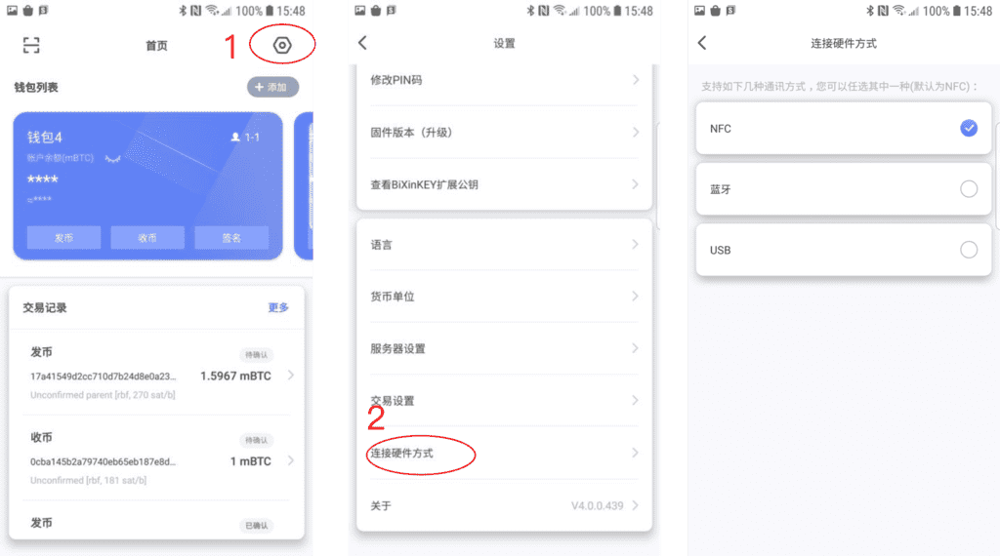
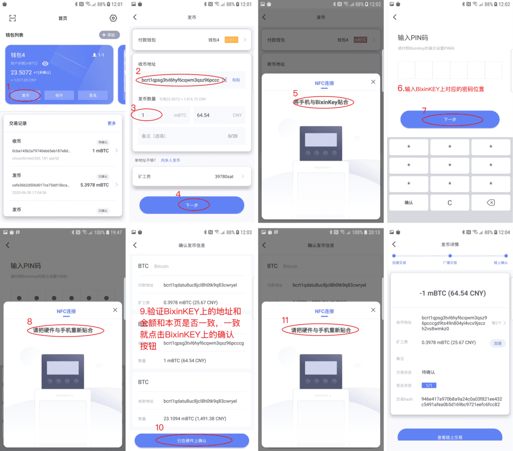
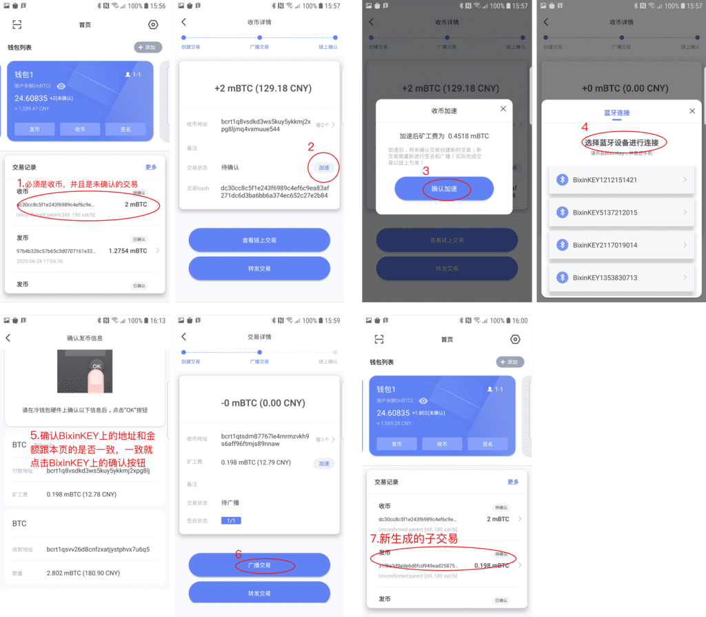
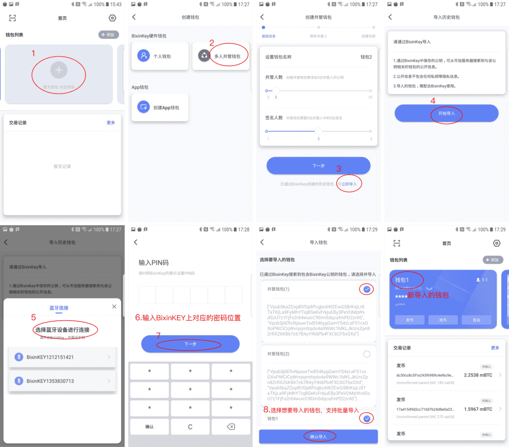
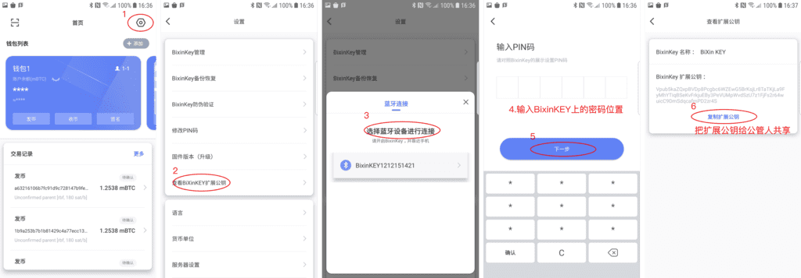
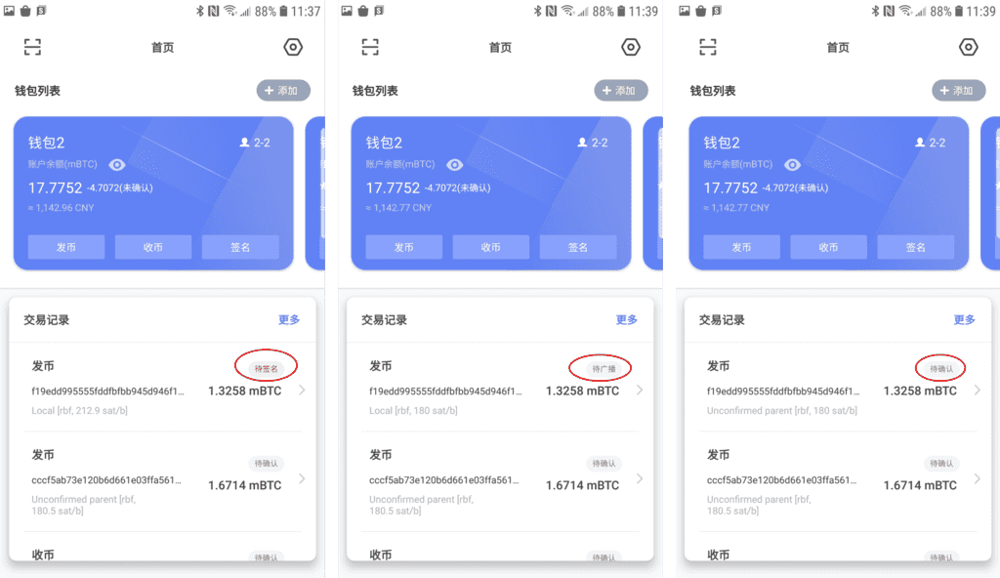
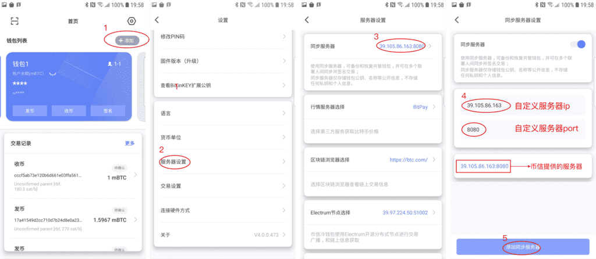
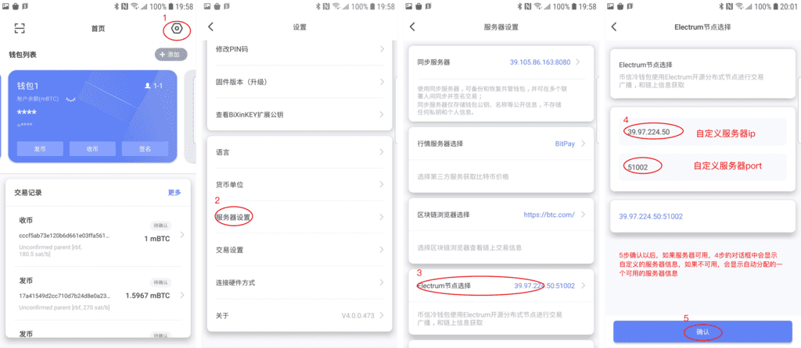

## **概述**
    BixinKEY APP不仅支持收币、发币等基本功能，还支持多签、收发币加速、离线创建交易、交易同步、钱包同步等扩展功能。本文档向用户展示了BixinKey App一些主要流程的使用方法。

##  **硬件连接方式的选择** 
- 目前支持蓝牙/nfc/usb三种连接模式，可自主进行切换(**使用USB连接时需要一个OTG转接头对接**)，切换流程如下：
      
  
##  **发币** 
- 下图对发币流程进行了详细的介绍
      

##  **发币时如何加速(RBF)** 
- rbf功能是发币方想对交易进行加速
      

##  **收币时如何加速(CPFP)** 
- cpfp是收币方想要对交易进行加速
      

##  **手机丢失怎么办?** 
- 因为异常原因用户的钱包信息丢失，此时，用户可以通过同步钱包的方式将之前同一BixinKEY创建的钱包同步下来，同步流程如下：
      
##  **共管钱包如何使用?** 
- 获取共管人的扩展公钥
  
      
- 用共管人分享的扩展公钥创建共管钱包
  
      
- 多个共管人如何对一笔交易进行共管？
    - A和B拥有相同Xpub创建的共管钱包
    - A创建一个交易1，此时B对应的共管钱包里会看到相同的交易信息，并且显示“待签名”状态
    - A签名后，通知B进行签名，此时B看到的交易是A签名后的交易，当B也进行签名后，交易显示“待广播”状态
    - A和B都可以进行广播交易，当交易广播以后，两个共管人的钱包里对应的当前交易状态都会显示为“待确认”
      

##  如何才能使自己的交易过程更安全？ 
###  **使用自己的同步服务器进行交易的同步** 
- 目前我们支持将交易同步到服务器上，这样不仅能避免因为二维码过大不能正确解析的问题，也能更方便共管人对交易进行维护和同步分发处理
- 如果用户对交易的安全性有很高的要求，可以设置自己的同步服务器，设置流程如下：
      

###  **配置自己的electrum服务器节点** 
####   &nbsp;&nbsp;目前有三种方式自定义electrum节点
- EPS(Electrum Personal Server) 
    网址：https://github.com/chris-belcher/electrum-personal-server
- ElectrumX 
    网址：https://electrumx.readthedocs.io/en/latest/features.html 
- ElectrumX和BTCPayserver整合 
    网址：https://docs.btcpayserver.org/ElectrumX/ 
- BWT (是一款轻巧、高性能的HD钱包跟踪器，有比特币完整节点支持，使用的模型类似于Electrum Personal Server)
    网址：(https://github.com/shesek/bwt) 
  
    
    
####  &nbsp;&nbsp; 设置electrum服务器节点 
- 如果配置了自定义的electrum服务器，就可以根据下边的流程在BixinKEY APP中进行连接
      